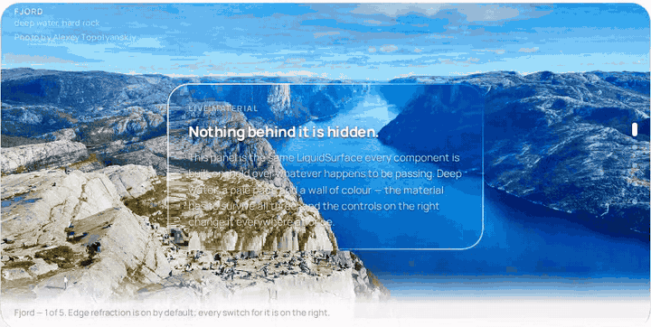

<picture>
  <source media="(prefers-color-scheme: dark)" srcset="brand/liquefy-logo-dark.svg">
  
</picture>

A TypeScript UI library that delivers highly transparent Liquid Glass through WebGL optics, physical springs, and accessible React primitives.



> This is an independent open-source project and is not affiliated with Apple Inc. It references public design principles while providing an original implementation for the web.

Nothing above is a video effect: that is a WebGL displacement map applied to the
live backdrop through `backdrop-filter`, and the way the shape stretches and
overshoots is a spring reading pointer velocity. Both are on by default. Drag it
yourself at **[liquefy-ui.com](https://liquefy-ui.com)**, which also hosts the
component reference and the shadcn registry.

## Packages

| Package | Purpose |
| --- | --- |
| `@liquefy-ui/react` | React components, themes, and provider |
| `@liquefy-ui/core` | Dependency-free WebGL, springs, and motion |
| `@liquefy-ui/icons` | Tree-shakeable React SVG icons |
| `@liquefy-ui/mcp` | MCP server that answers component questions from the real API |

## Quick start

```bash
pnpm add @liquefy-ui/react @liquefy-ui/core @liquefy-ui/icons
```

```tsx
import { LiquefyProvider, LiquidButton } from '@liquefy-ui/react'
import { SparklesIcon } from '@liquefy-ui/icons'
import '@liquefy-ui/react/styles.css'

export function App() {
  return (
    <LiquefyProvider theme="system" tint="#8f8f8f">
      <LiquidButton iconBefore={<SparklesIcon />}>
        Create magic
      </LiquidButton>
    </LiquefyProvider>
  )
}
```

## Next.js and React Server Components

Every component needs state, refs or the WebGL lens, so the whole package sits on
the client side of an RSC boundary. The published bundles carry a `'use client'`
directive, so importing them straight into a server component works — no wrapper
file needed. Only event handlers have to move: a function cannot cross from a
server component into a client one, so anything with `onClick` or local state
belongs in its own `'use client'` component.

`apps/next-example` is a working Next.js 16 App Router app whose page is a server
component, and its build runs in CI. If the client boundary ever regresses, that
build fails rather than yours.

## Tailwind CSS v4

Import `tailwind.css` instead of `styles.css`, before Tailwind itself:

```css
@import '@liquefy-ui/react/tailwind.css';
@import 'tailwindcss';
```

That declares the cascade layer order — so `className="rounded-full"` on a
`LiquidButton` actually wins — and bridges the `--lq-*` tokens into Tailwind's
theme as `bg-liquid-accent`, `text-liquid-muted`, `rounded-liquid`,
`shadow-liquid`, `ease-liquid` and friends. The bridge uses `@theme inline`, which
is what keeps those utilities resolving per-theme at use time.

## For coding agents

| What | Where |
| --- | --- |
| MCP server | `claude mcp add liquefy-ui -- npx -y @liquefy-ui/mcp` — eight tools answering from the real exports, no network, no dependencies |
| `llms.txt` | [`/llms.txt`](https://liquefy-ui.com/llms.txt) and [`/llms-full.txt`](https://liquefy-ui.com/llms-full.txt), generated from source |
| One page per component | [`/llms/liquid-button.md`](https://liquefy-ui.com/llms/liquid-button.md), plus `icons.md`, `core.md` and `mcp.md` — plain Markdown, because the docs site is a hash-routed SPA that a fetcher without JavaScript cannot read |
| shadcn registry | `npx shadcn@latest add https://liquefy-ui.com/r/liquid-button.json` |

The MCP tools are `get_conventions`, `list_components`, `get_component`,
`search_components`, `get_component_source`, `get_tokens`, `list_icons` and
`get_core_api`. The catalog behind them is generated from source at build time, and
lists only names the package entry point re-exports — so an agent is never told to
import something that does not resolve.

The registry copies real component source into your project rather than a
re-export, with imports rewritten to `@/components/ui`, `@/lib` and `@/hooks`. The
copied tree keeps `@liquefy-ui/core` and `@base-ui/react` from npm but not
`@liquefy-ui/react`, so a copied `LiquefyProvider` never ends up competing with the
packaged one. Every copied file is written with its own `'use client'` directive, so an
RSC app needs no follow-up edit.

## Documentation

Everything is on **[liquefy-ui.com](https://liquefy-ui.com)**:

| Route | Contents |
| --- | --- |
| `#/` | The playground first, then framework and agent-tooling compatibility, then component samples |
| `#/playground` | Every `LiquefyProvider` prop as a live control, applied to the whole site |
| `#/components` | Index of every component, each with live demos and a full prop table |
| `#/docs` | Introduction, installation, provider, theming, the `styles` prop, motion |
| `#/docs/frameworks` · `#/docs/tailwind` · `#/docs/ai-tooling` | Integration |
| `#/docs/accessibility` · `#/docs/performance` · `#/docs/troubleshooting` | Practices |

Old `#/guides/*` links redirect to their `#/docs/*` equivalents.

## Style overrides: the `styles` prop

Every component takes a `styles` prop for one-off overrides, so reaching for a
stylesheet is optional. It is a superset of `style`:

```tsx
<LiquidButton
  styles={{
    color: 'accent',            // colour words resolve to var(--lq-accent)
    p: 3,                       // spacing keys count --lq-space units
    w: { base: '100%', md: 240 }, // responsive, per breakpoint
    boxShadow: '$shadow',       // $token → var(--lq-token), anywhere in a string
    _hover: { bg: '$glass-soft' },
    _dark: { opacity: 0.92 },
    '&:has(svg)': { gap: 2 },   // raw selectors start with &, at-rules with @
  }}
>
  Create magic
</LiquidButton>
```

| Feature | Notes |
| --- | --- |
| CSS properties | Every camelCase property, plus `--custom-properties`. Numbers become `px`, matching `style`. |
| Spacing shorthands | `p`, `px`, `py`, `pt`/`pr`/`pb`/`pl`, and the `m` equivalents. Numbers count `--lq-space` units (`4px` by default, set `spacing` on the provider). `gap` and friends use the same scale. |
| Other shorthands | `w`, `h`, `size`, `minW`/`maxW`/`minH`/`maxH`, `bg`, `radius`. `radius` drives `--lq-radius`, so the press-squish keeps animating the corners. |
| Tokens | `$name` anywhere in a string resolves to `var(--lq-name)`. Colour properties also accept the bare words `accent`, `tint`, `foreground`, `muted`, `placeholder`, `text`, `line`. |
| Responsive | `{ base, sm, md, lg, xl }`, ordered ascending no matter how you write it. Override the widths with `breakpoints` on `LiquefyProvider`. |
| States | `_hover`, `_focus`, `_focusVisible`, `_active`, `_disabled`, `_checked`, `_selected`, `_expanded`, `_open`, `_invalid`, `_readOnly`, `_placeholder`, `_first`, `_last`, `_odd`, `_even`, and `_dark` / `_light` (which cover both the explicit theme and `theme="system"`). |

Static values ride the `style` attribute, so the common case adds no stylesheet
and no hydration concerns. As soon as a state or breakpoint appears, the whole
object moves into a generated class instead — otherwise the inline declarations
would outrank the very rules meant to override them. That class is inserted
**unlayered**, and the component stylesheet lives in `@layer liquefy-ui`, so
overrides win on cascade order rather than on `!important` or specificity.

Precedence is `styles` over the component's own custom properties, and `style`
over everything — `style` stays the last-resort escape hatch.

`transform` and `backdrop-filter` are written inline by the jelly springs every
frame and cannot be overridden through `styles`; development builds warn if you
try. Wrap the component and style the wrapper instead.

Building your own component on the same system:

```tsx
import { useLiquidStyles, type LiquidStyleProps } from '@liquefy-ui/react'

export const Panel = ({ className, style, styles, ...props }: LiquidStyleProps & JSX.IntrinsicElements['div']) => {
  const root = useLiquidStyles('my-panel', { className, style, styles })
  return <div className={root.className} style={root.style} {...props} />
}
```

Server rendering: `useInsertionEffect` does not run on the server, so flush the
collected rules into the document head yourself with `getLiquefyStyleSheet()`.
Static-only `styles` need nothing — they are already inline.

`LiquefyProvider` takes `className` and `style` but not `styles` — it owns the
config that `styles` reads. `LiquidToastProvider` takes none of the three: it
renders no root element of its own, only the toast viewport. `slotStyles` is reserved for per-part styling
(`{ header, body, footer }`) and is not implemented yet.

The full version of this — every shorthand, token reference, breakpoint and state
key, plus custom components and server rendering — is at `#/docs/styles-prop`,
with the token system itself at `#/docs/theming`.

## Components

33 components and 44 icons, each with live demos and a full prop table at
[liquefy-ui.com/#/components](https://liquefy-ui.com/#/components).

| Category | Components |
| --- | --- |
| Inputs | `LiquidButton`, `LiquidIconButton`, `LiquidCheckbox`, `LiquidRadioGroup` / `LiquidRadio`, `LiquidSwitch`, `LiquidSlider`, `LiquidTextField`, `LiquidTextArea`, `LiquidSelect`, `LiquidSegmented`, `LiquidRating` |
| Data display | `LiquidAvatar` / `LiquidAvatarGroup`, `LiquidBadge`, `LiquidChip`, `LiquidTooltip`, `LiquidTable` family, `LiquidList` family, `LiquidDivider` |
| Feedback | `LiquidAlert`, `LiquidProgress`, `LiquidSpinner`, `LiquidSkeleton`, `LiquidToastProvider` / `useLiquidToast`, `LiquidDialog` |
| Surfaces | `LiquidSurface`, `GlassCard`, `LiquidAccordion` / `LiquidAccordionItem` |
| Navigation | `LiquidTabs` family, `LiquidBreadcrumbs`, `LiquidPagination`, `LiquidMenu`, `LiquidDrawer`, `GlassDock` / `DockItem` |
| Foundation | `LiquefyProvider`, `useLiquefyConfig`, `useLiquidGlass`, `useLiquidStyles`, `getLiquefyStyleSheet`, `defaultBreakpoints` |

When WebGL is unavailable, components automatically fall back to the transparent CSS material. Effects default to on everywhere; use the `motion` and `transparency` provider props to tone them down.

Use `theme="dark"`, `theme="light"`, or `theme="system"` on `LiquefyProvider` to control appearance.

## Design notes

- **Real edge refraction**: a WebGL shader bakes a rounded-rect lens displacement map, applied to the live backdrop through an SVG `feDisplacementMap` inside `backdrop-filter` (with per-channel chromatic dispersion). Chromium renders it fully; WebKit and Gecko gracefully fall back to the blurred CSS material.
- **One shared WebGL context**: browsers cap live WebGL contexts (~16 per page), so every component draws through a single hidden GL canvas and blits into its own 2D canvas. Any number of glass components can coexist.
- **Jelly physics**: scale, skew, and tilt run on deliberately underdamped springs. Pointer velocity is injected into the springs, so fast sweeps make surfaces sway, and press/release produces several visible overshoots. The shader receives the same energy as `u_wobble` and wiggles the rim in sync.
- The overlay shader renders SDF-shaped rim light with RGB dispersion, iridescence, pointer glow, press ripples, and a moving sheen — only during interaction and decay, never continuously.
- Glass is intended for interaction and navigation layers rather than primary content.
- **Accessibility comes from Base UI**: Dialog, Drawer, Menu, Select, Tooltip, Tabs and Accordion are built on `@base-ui/react`, which supplies focus trapping and restoration, scroll locking, Escape handling, roving tabindex, typeahead, and collision-aware positioning. liquefy-ui keeps the optics and the springs and stops re-implementing the parts that are easy to get subtly wrong. The keyboard behaviour is asserted in `packages/react/test/keyboard.test.tsx` rather than assumed.
- React and React DOM are peer dependencies, preventing duplicate React bundles.
- Motion and transparency are **always on by default**, independent of OS accessibility settings (macOS "Reduce Motion" / "Reduce Transparency" silently flip both media queries in every desktop browser). Toggle them per subtree with `motion={false}` / `transparency={false}` on `LiquefyProvider`; apps that want to honor the OS can pass e.g. `motion={!matchMedia('(prefers-reduced-motion: reduce)').matches}` or use the core-level `respectReducedMotion` / `respectReducedTransparency` options.

## Contributing

Issues and pull requests are welcome. `rc` is the development branch — branch from
it and open the pull request back into it. [CONTRIBUTING.md](./CONTRIBUTING.md) has
the local setup, the test suites, the CI jobs and the commit convention.

## Sponsor

[GitHub Sponsors](https://github.com/sponsors/yu5ag) funds the maintenance of this
library — the shader work, the browser matrix, and the release plumbing that keeps
`pnpm add @liquefy-ui/react` boring. Sponsorship goes to the maintainer rather than
to an organisation; there is one of us.

GitHub takes no cut, so the whole amount arrives. One-off is as welcome as monthly.

## License

MIT
